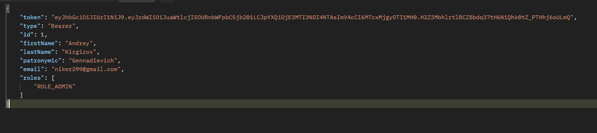
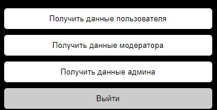

# Spring boot login, registration, recovery, change password service with JwtTokens
## Spring Boot v. 3.1.0, SDK 21, Java 17

### Запуск проекта

Для запуска проекта установите все зависимости из pom.xml(обычно это происходит само).  
В случае неудачи нажмите на pom.xml и выберите   
#### Maven -> Reload project

Настройте сервис отправки сообщений.  
#### src/main/resources/application.properties  
В данном файле хранятся поля  
spring.mail.username = ENTER_YOUR_MAIL  
spring.mail.password = ENTER_YOUR_APP_PASSWORD  
(пароль приложения получается на https://myaccount.google.com, учтите что должна быть включена двухэтапная аунтефикация)

Для тестового запуска можете использовать мои данные  
spring.mail.username = no.reply158685@gmail.com  
spring.mail.password = yhwlfxchixlipokc

Запустите контейнер с бд командой  
#### docker-compose up -d
Все миграции автоматически будут внесены в данную бд при успешном запуске проекта.  
Миграция также создаст пользователя  

{  
"email": "niker299@gmail.com",  
"password": "123456789"  
}  
с role: {"admin"}  
Проверить успешность миграций можно командой  
#### docker exec -it postgres_db psql -U postgres -d OlimpDB
После этого введя команду  
#### \dt

После успешного запуска проекта через файл  
#### src/main/java/com/Bracerr/AuthService/SpringBootSecurityPostgresqlApplication.java  
можно перейти по ссылке в браузере  
#### http://localhost:8080/swagger-ui/index.html#/
Для просмотра функционала API  

Также у проекта есть простой ui построенный на Spring MVC для демонстрации функционала,
он находится по ссылке  
#### http://localhost:8080

### Описание проекта
Данный проект использует технологию JwtToken для доступа ресурсов у пользователей.  
Некоторые url отмечены аннотацией @PreAuthorize из библиотеки Spring Security, которая не пускает по ссылке без авторизации или указанной роли.  
Проверка и генерация токенов происходит на сервере в дериктории  
#### src/main/java/com/Bracerr/AuthService/security  
Настроить время жизни токена и его кодовое слово можно в application.properties  
#### app.jwtSecret= 1234567891234567891234567891234567891234567891234567891234567891  
#### app.jwtExpirationMs= 86400000  

При регистрации пользователя отправляется запрос(http://localhost:8080/api/auth/signup), в котром идет проверка на то, что email не занят и отправленные пароли совпадают. Генерируется токен подтверждения почты и записывается в бд.  

После этого на указанную почту отправляется ссылка для подтверждения почты. Перейдя по ней вы подтвердите аккаунт и будете направлены на страницу авторизации. На странице подтверждения проверяется валидность токена и срок его действия(в данном случае 5 минут)  
Настроить срок службы ссылки можно в application.properties в переменной  
#### link.timeout.minutes = 5  
В случае невалидности токена происходит редирект на повторную регистрацию  
При подтверждении почты токен удаляется автоматически. Также настроен слушатель, который раз в минуту проверяет истекшие токены и удаляет их для возможности повторной регистрации  

После всего этого пользователь должен пройти авторизацию. Отправляется запрос на(http://localhost:8080/api/auth/signin)  
На данном url проверяются корректность введенных данных и после успешного подтверждения выдается jwtToken в localStorage браузера, который используется для дальнейших действий на сайте  
Также при авторизации имеется проверка на то, что аккаунт еще не подтвержден и его ожидает письмо на почте  
  
Вы можете попробовать авторизоваться с данными заранее созданного пользователя.  

На странице логирования также присутсвует кнопка
#### Забыли пароль  
Данная кнопка просит ввести email, проверяет его на наличие в базе и в случае успеха отправляет письмо смены пароля на указнный email.  
Работа ссылки восстановления пароля аналогична с ссылкой подтверждения почты.  
После перехода по ссылке на почте пользователя просят ввести новый пароль и подвтердить его, после чего происходит редирект на страницу логирования.  
На данной ссылке также присутсвует проверка валидности токена  
При успешной смене пароля токен удаляется для возможности повторной смены пароля. Также настроен слушатель, который раз в минуту проверяет истекшие токены для возможности повторного запроса  
Настроить срок службы ссылки восстановления можно в application.properties  

#### link.recovery.password.minutes = 5  

После успешного логирования пользователь переходит на страницу (http://localhost:8080/manage), которая защищена от неавторизрованного доступа  
На ней есть кнопки проверки роли пользователя и кнопка logout  

